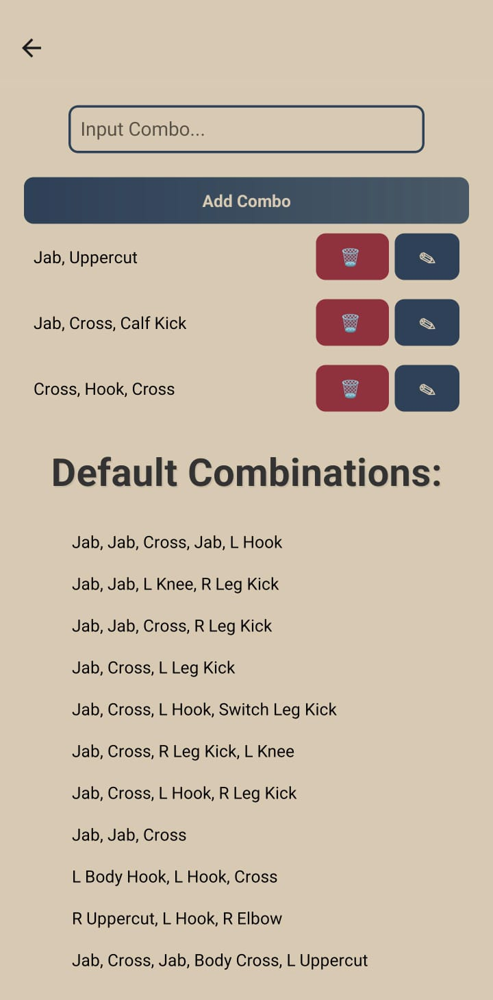
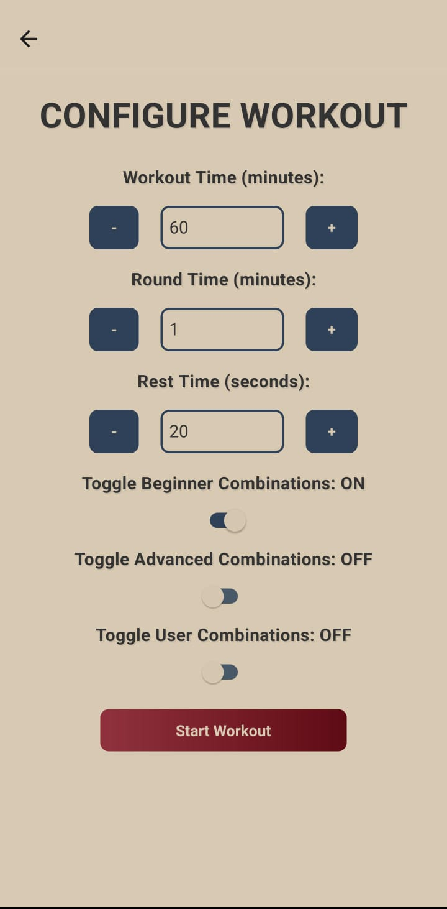
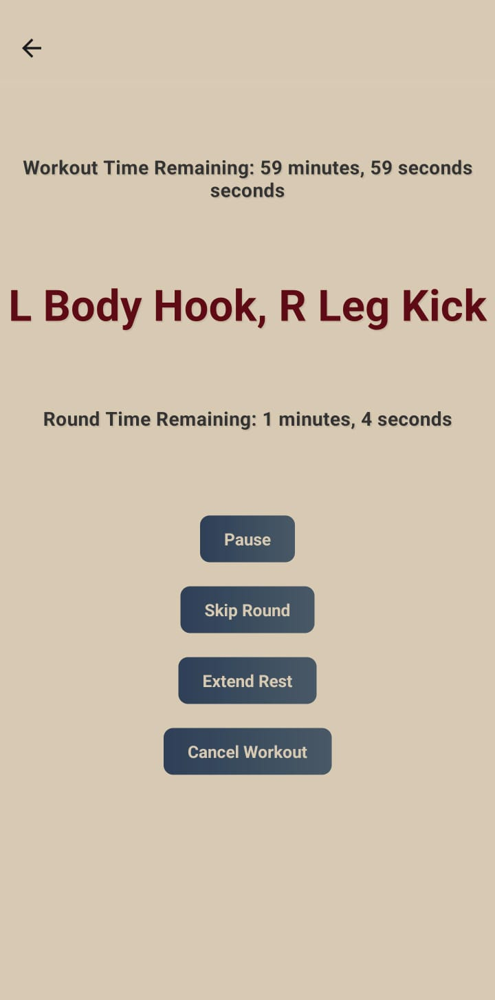
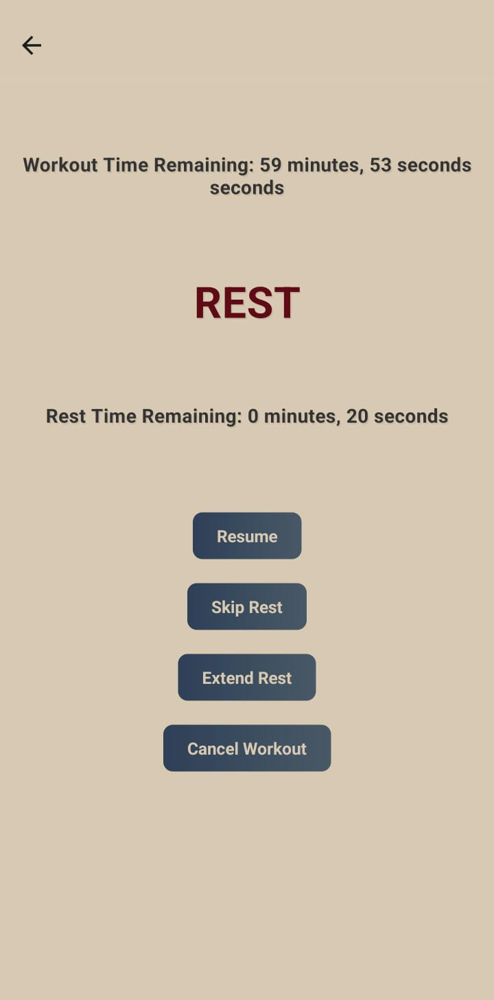
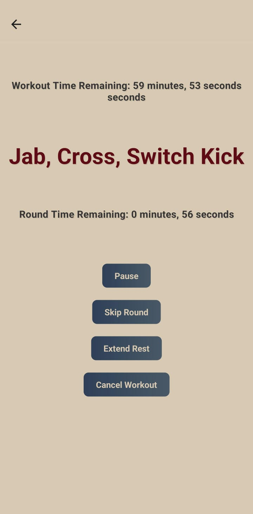

<br/>
<p align="center">
  <h3 align="center">MuayThaideas</h3>

  <p align="center">
    A simple app made to aid pad/bag work in Muay Thai.
    <br/>
    <br/>
  </p>
</p>

 

## About The Project

Not sure if it's just me, but whenever I get in front of a punching bag, my mind loses all capability of thought. Rather than drilling combinations from the previous class, it's usually a case of throw with no thought until I'm bored.

I put together this app to simply guide me through a light bag workout.

Features:
 - A set of built-in beginner & advanced combinations.
 - User can add, edit and delete their own combinations.
 - User can set up a workout defining the overall workout time, individual round time and rest time.
 - Some niceties also exist during the workout - pause/resume, skip a round, skip a rest, extend a rest by 10s, and cancel the workout.

At it's current stage, there is only a small number of validation checks as it's not intended to be used by many, if any more than just myself. There is also little testing outside of my Google Pixel 7 Pro as I don't quite have the internet speed or storage capacity to get emulators up and running.

## Built With

React Native & Expo!

## Getting Started

If you want to play with the source code, see below:

### Prerequisites

Needed:

* npm
* Android SDK

```sh
npm install npm@latest -g
```

### Installation

1. Clone the repo

```sh
git clone https://github.com/JJB9922/MuayThaideas
```

2. Navigate to the folder (MuayThaideas/MuayThaideas)

3. Install NPM/NPX packages

```sh
npm install
```

```sh
npx install
```

4. Run the app!

```sh
npx expo start
```

Web mode doesn't work as I use an incompatible expo filesystem import - I've been checking by having my android attached to the system and pressing (a) on the keyboard to load the Expo Go app and simulate the dev build there.

## Usage

I tried to make the UI as minimalist and as intuitive as possible: so here are some screenshots!












## Contributing

Contributions are what make the open source community such an amazing place to be learn, inspire, and create. Any contributions you make are **greatly appreciated**.
* If you have suggestions for adding or removing projects, feel free to [open an issue](https://github.com/JJB9922/MuayThaideas/issues/new) to discuss it, or directly create a pull request after you edit the *README.md* file with necessary changes.
* Please make sure you check your spelling and grammar.
* Create individual PR for each suggestion.
* Please also read through the [Code Of Conduct](https://github.com/JJB9922/MuayThaideas/blob/main/CODE_OF_CONDUCT.md) before posting your first idea as well.

### Creating A Pull Request

1. Fork the Project
2. Create your Feature Branch (`git checkout -b feature/AmazingFeature`)
3. Commit your Changes (`git commit -m 'Add some AmazingFeature'`)
4. Push to the Branch (`git push origin feature/AmazingFeature`)
5. Open a Pull Request

## License

Distributed under the MIT License. See [LICENSE](https://github.com/JJB9922/MuayThaideas/blob/main/LICENSE.md) for more information.

## Authors

* **JJB9922** - *Software Engineer* - [JJB9922](https://github.com/JJB9922/) - *Made the app!*
